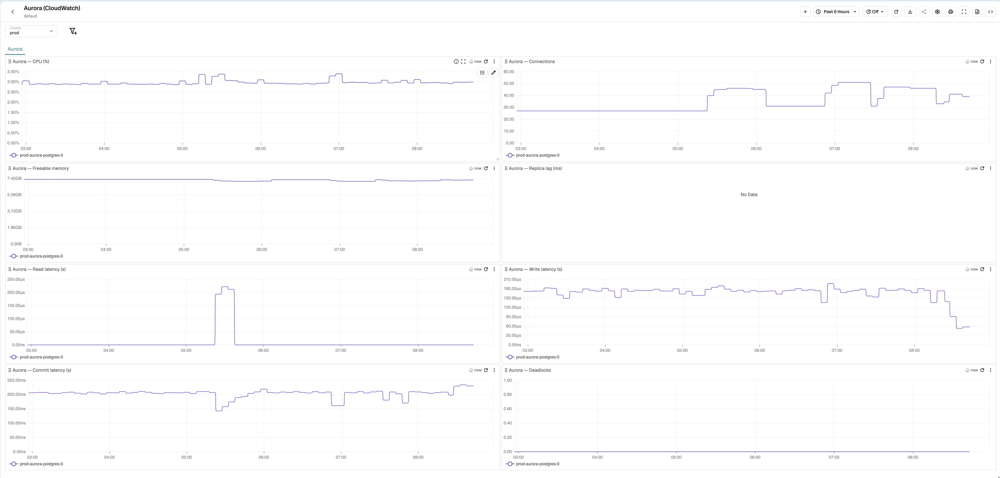

# AWS Aurora Monitoring Dashboard (CloudWatch)

This repository contains a JSON file for a comprehensive AWS Aurora monitoring dashboard on OpenObserve. It visualizes `AWS/RDS` CloudWatch metrics for Aurora clusters, scraped through the [cloudwatch-exporter](https://github.com/prometheus/cloudwatch_exporter) and ingested as Prometheus-style metrics. By importing this dashboard, you gain immediate visibility into the health and performance of your Aurora database instances.

## Dashboard Features

The JSON file includes panels covering various critical metrics, such as:

- **CPU Utilization (%)**: Monitor per-instance CPU usage to ensure optimal performance.
- **Database Connections**: Track the number of active connections to each Aurora instance.
- **Freeable Memory**: Observe available memory to anticipate pressure and plan capacity.
- **Aurora Replica Lag (ms)**: Measure replication delay between the writer and its read replicas.
- **Read Latency (s)**: Track how long read operations take on each instance.
- **Write Latency (s)**: Track how long write operations take on each instance.
- **Commit Latency (s)**: Monitor transaction commit times to spot write bottlenecks.
- **Deadlocks**: Detect deadlock events to catch contention issues early.

All panels are broken down by `dbinstance_identifier` and can be filtered by the **Cluster** variable (`k8s_cluster`).

## Metrics Used

The dashboard relies on the following CloudWatch `AWS/RDS` metrics (via cloudwatch-exporter):

| Panel | Metric stream |
| --- | --- |
| CPU (%) | `aws_rds_cpuutilization_average` |
| Connections | `aws_rds_database_connections_average` |
| Freeable memory | `aws_rds_freeable_memory_average` |
| Replica lag (ms) | `aws_rds_aurora_replica_lag_average` |
| Read latency (s) | `aws_rds_read_latency_average` |
| Write latency (s) | `aws_rds_write_latency_average` |
| Commit latency (s) | `aws_rds_commit_latency_average` |
| Deadlocks | `aws_rds_deadlocks_average` |

## How to Import

1. In OpenObserve, go to **Dashboards** and click **Import**.
2. Upload `AWS_Aurora_CloudWatch.dashboard.json`.
3. Make sure the CloudWatch `AWS/RDS` metrics above are being ingested into your OpenObserve instance.
4. Select the appropriate **Cluster** value to scope the dashboard to your environment.

