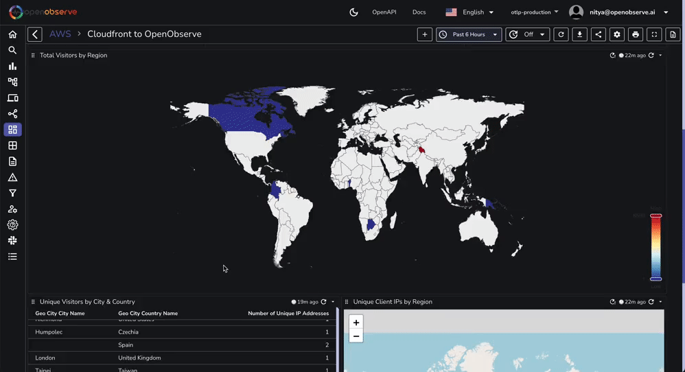

# AWS Cloudfront Access Logs

This repository contains a JSON file that you can import directly into OpenObserve to visualize Cloudfront access logs.

You will be able to visualize the data in OpenObserve in less than 2 minutes:

**Step 1: Import the dashboard:**
 
  

 

**Step 2: Explore the dashboard:**
 

 

**Step 3: Customize the dashboard:**

 

If you want to learn more about how to set up a Cloudfront Distribution, a Kinesis Stream, an Amazon Data Firehose, and OpenObserve to create this data visualization pipeline, follow along with our [step-by-step guide](https://openobserve.ai/blog/monitor-cloudfront-access-logs-kinesis-streams-amazon-data-firehose-guide).
