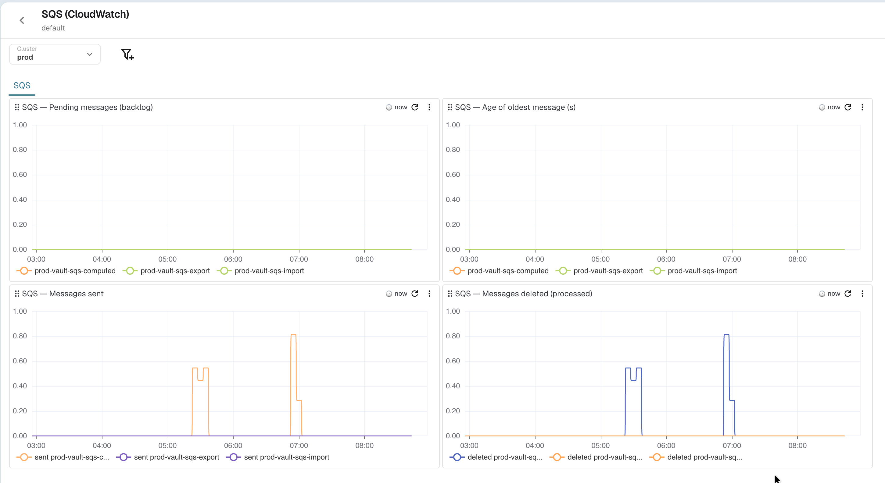

# AWS SQS Monitoring Dashboard (CloudWatch)

This repository contains a JSON file for a comprehensive AWS SQS (Simple Queue Service) monitoring dashboard on OpenObserve. It visualizes `AWS/SQS` CloudWatch metrics, scraped through the [cloudwatch-exporter](https://github.com/prometheus/cloudwatch_exporter) and ingested as Prometheus-style metrics. By importing this dashboard, you gain immediate visibility into the health and throughput of your SQS queues.

## Dashboard Features

The JSON file includes panels covering various critical metrics, such as:

- **Messages Backlog**: Track the approximate number of visible (pending) messages per queue.
- **Age of Oldest Message (s)**: Detect processing delays by watching how long the oldest message has been waiting.
- **Messages Sent**: Monitor the rate of messages being published to each queue.
- **Messages Deleted (processed)**: Observe the rate of messages consumed and acknowledged.

All panels are broken down by `queue_name` and can be filtered by the **Cluster** variable (`k8s_cluster`).

## Metrics Used

The dashboard relies on the following CloudWatch `AWS/SQS` metrics (via cloudwatch-exporter):

| Panel | Metric stream |
| --- | --- |
| Messages backlog | `aws_sqs_approximate_number_of_messages_visible_average` |
| Age of oldest message (s) | `aws_sqs_approximate_age_of_oldest_message_average` |
| Messages sent | `aws_sqs_number_of_messages_sent_average` |
| Messages deleted | `aws_sqs_number_of_messages_deleted_average` |

## How to Import

1. In OpenObserve, go to **Dashboards** and click **Import**.
2. Upload `AWS_SQS_CloudWatch.dashboard.json`.
3. Make sure the CloudWatch `AWS/SQS` metrics above are being ingested into your OpenObserve instance.
4. Select the appropriate **Cluster** value to scope the dashboard to your environment.

