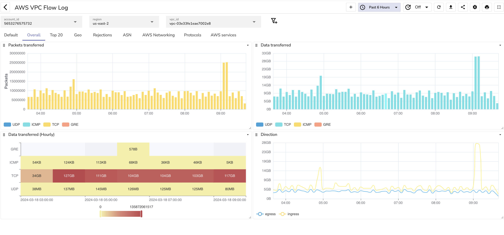
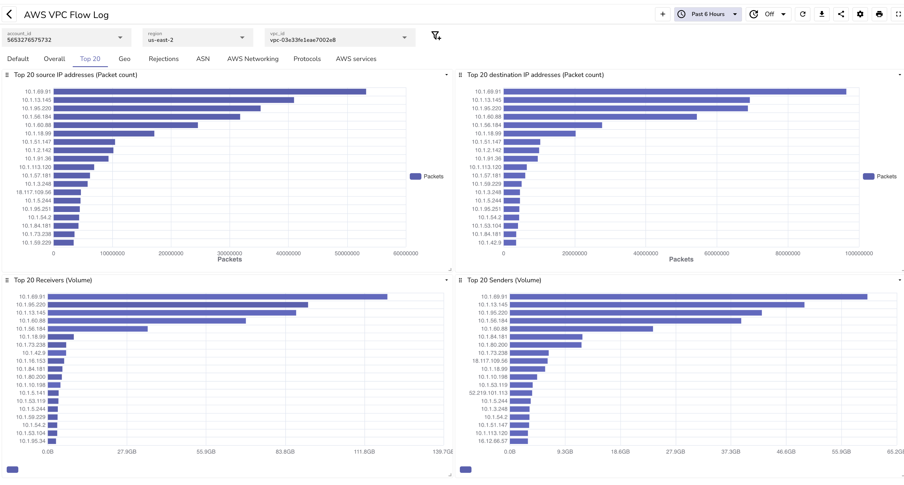
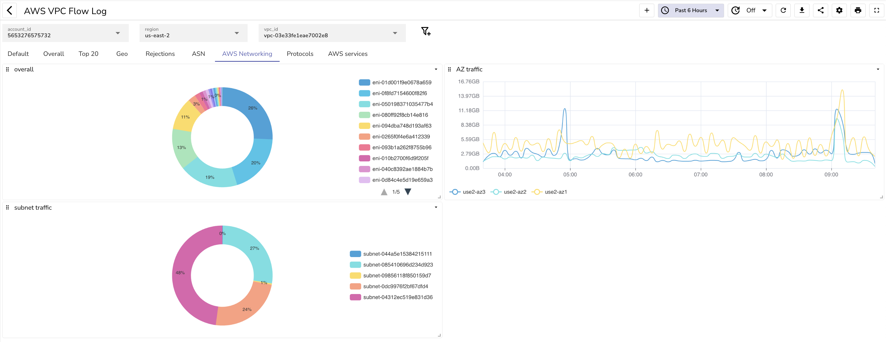
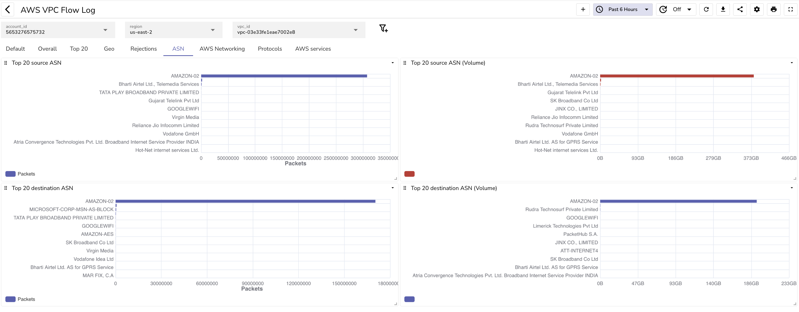
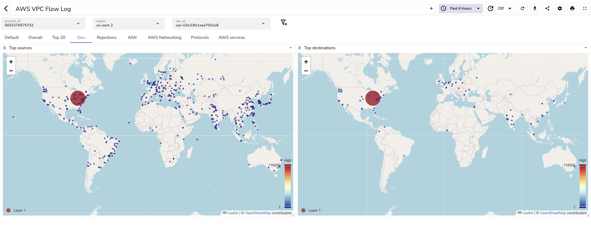
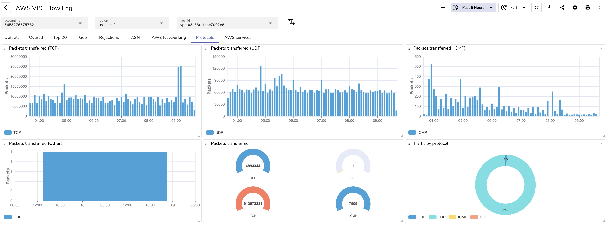
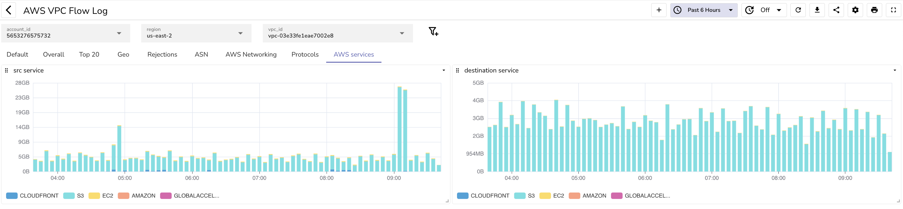
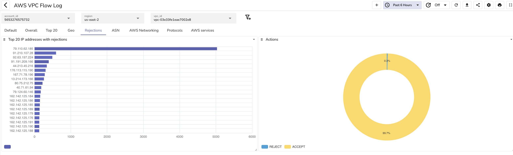

# AWS VPC Flow log

Visualize AWS VPC Flow logs in OpenObserve. In order to understand how to set this up, please refer to the [OpenObserve blog on AWS VPC flow log](https://openobserve.ai/blog/how-to-capture-aws-vpc-flow-logs-and-analyze-them).

## High level info

## Top 20

## AWS networking

## ASN details

## Geo details

## Protocol details

## AWS Services

## Rejected traffic

