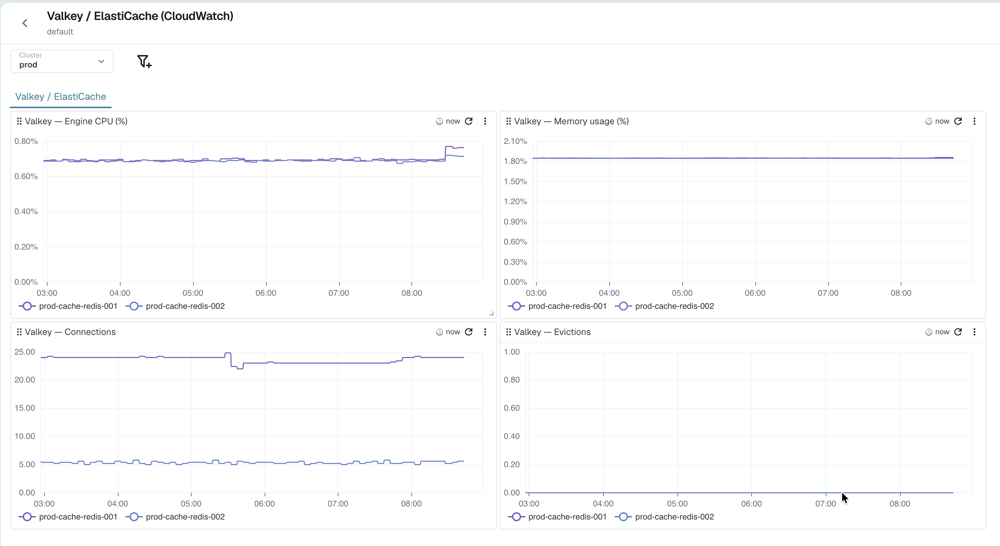

# Valkey / ElastiCache Monitoring Dashboard (CloudWatch)

This repository contains a JSON file for a comprehensive Valkey monitoring dashboard on OpenObserve, based on AWS ElastiCache. It visualizes `AWS/ElastiCache` CloudWatch metrics, scraped through the [cloudwatch-exporter](https://github.com/prometheus/cloudwatch_exporter) and ingested as Prometheus-style metrics. By importing this dashboard, you gain immediate visibility into the health and performance of your Valkey (ElastiCache) cache clusters.

## Dashboard Features

The JSON file includes panels covering various critical metrics, such as:

- **Engine CPU Utilization (%)**: Monitor the CPU used by the Valkey engine process per cache cluster.
- **Memory Usage (%)**: Track database memory usage to anticipate pressure and evictions.
- **Connections**: Observe the current number of client connections to each cache cluster.
- **Evictions**: Detect keys being evicted due to memory pressure, a sign of undersized capacity.

All panels are broken down by `cache_cluster_id` and can be filtered by the **Cluster** variable (`k8s_cluster`).

## Metrics Used

The dashboard relies on the following CloudWatch `AWS/ElastiCache` metrics (via cloudwatch-exporter):

| Panel | Metric stream |
| --- | --- |
| Engine CPU (%) | `aws_elasticache_engine_cpuutilization_average` |
| Memory usage (%) | `aws_elasticache_database_memory_usage_percentage_average` |
| Connections | `aws_elasticache_curr_connections_average` |
| Evictions | `aws_elasticache_evictions_average` |

## How to Import

1. In OpenObserve, go to **Dashboards** and click **Import**.
2. Upload `Valkey_ElastiCache_CloudWatch.dashboard.json`.
3. Make sure the CloudWatch `AWS/ElastiCache` metrics above are being ingested into your OpenObserve instance.
4. Select the appropriate **Cluster** value to scope the dashboard to your environment.

