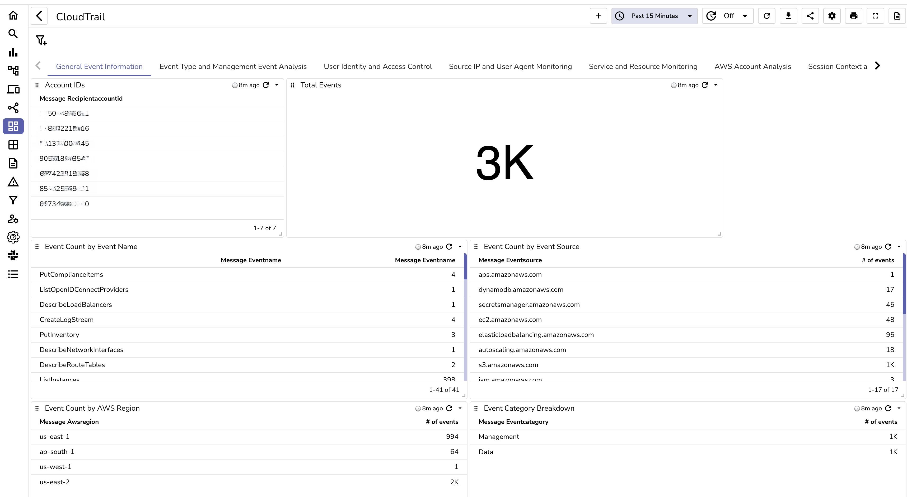

# CloudTrail Monitoring Dashboard

This repository contains a JSON file for a comprehensive CloudTrail monitoring dashboard on OpenObserve. By importing this dashboard, you gain immediate visibility into key insights, helping you monitor cloud audits and security events.

## Dashboard Features
The JSON file includes panels covering various critical metrics, such as:

- General event information
- Event Type and management analysis
- User identity and access control
- Source IP and user agent monitoring
- Service and resource monitoring
- AWS account analysis
- Session context and security
- CloudTrail log and subscription monitoring

