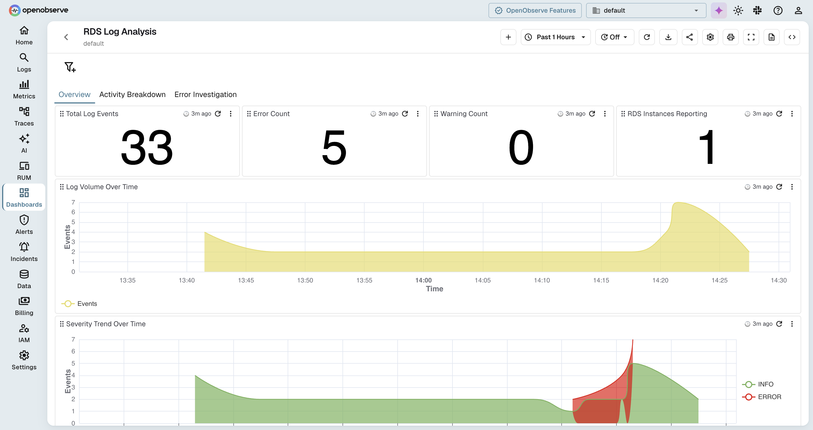
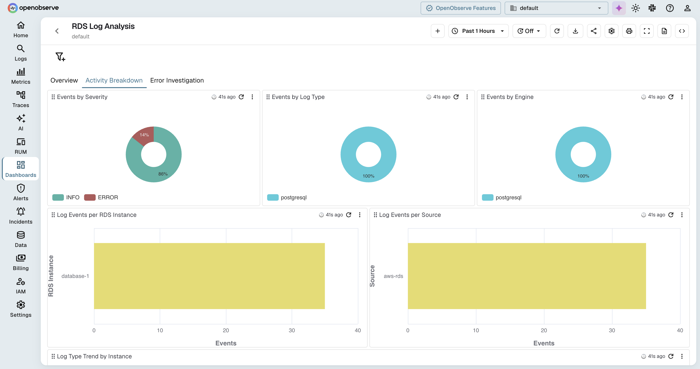

# AWS RDS Logs Dashboard

This repository contains a JSON file for a comprehensive AWS RDS Logs monitoring dashboard on OpenObserve. By importing this dashboard, you gain immediate visibility into your RDS database activity, helping you monitor query performance, errors, and security events.

## Prerequisites

- AWS RDS logs (Error, Slow Query, General, Audit) exported to CloudWatch or S3

## How to Use

1. Download the dashboard JSON file from this folder.
2. Log in to your OpenObserve instance.
3. Navigate to **Dashboards** and click **Import**.
4. Upload the JSON file and map it to your RDS logs stream.

## Screenshots

