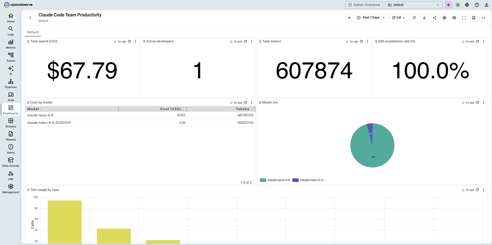

# Claude Code Team Productivity Dashboard

This folder provides a JSON file for a Claude Code team productivity dashboard in OpenObserve. Claude Code emits OpenTelemetry metrics and events; route them to OpenObserve over OTLP and import this dashboard to see usage, cost, and adoption across your team in one view.

## Dashboard Features
The JSON file includes panels that track key metrics such as:

- Total spend, active developers, and total tokens
- Edit acceptance rate
- Token usage over time
- Model mix and cost by model
- Tool usage
- Per-developer breakdowns: cost, edit acceptance rate, and model mix

## Import
In OpenObserve, open **Dashboards**, click **Import**, and upload `Claude Code.dashboard.json`. Every panel queries an events stream named `claude_code`; if your stream is named differently, update the stream reference in each panel.

