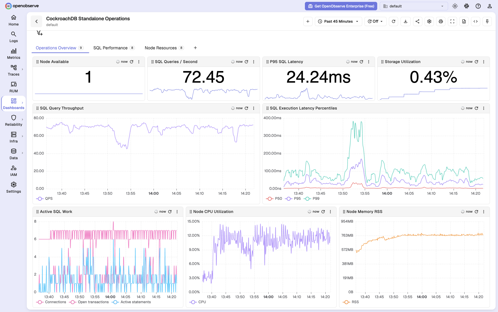
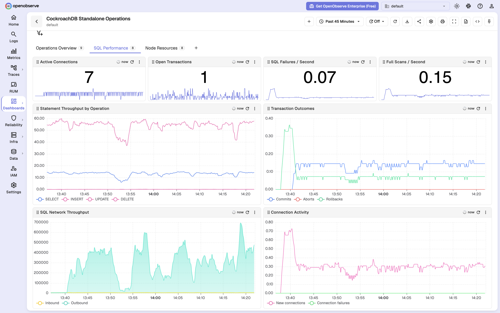
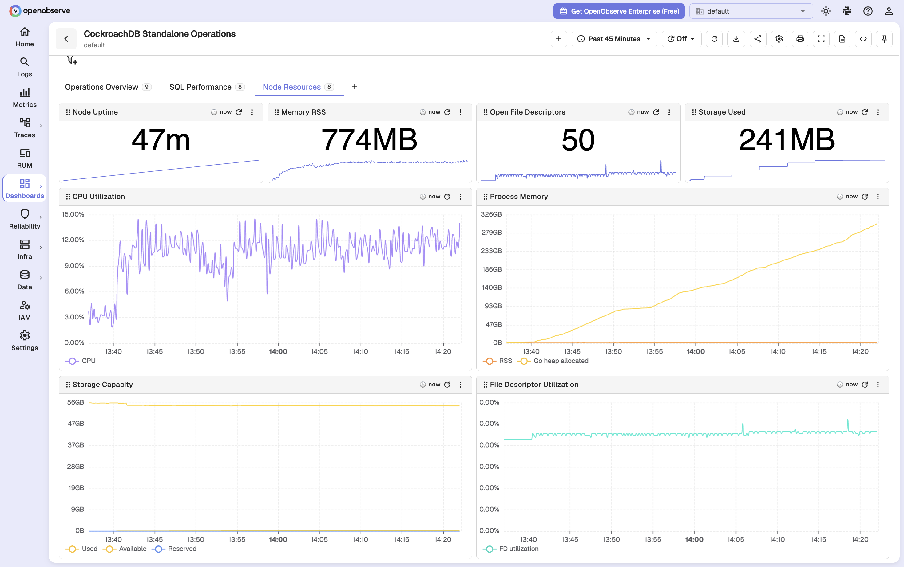
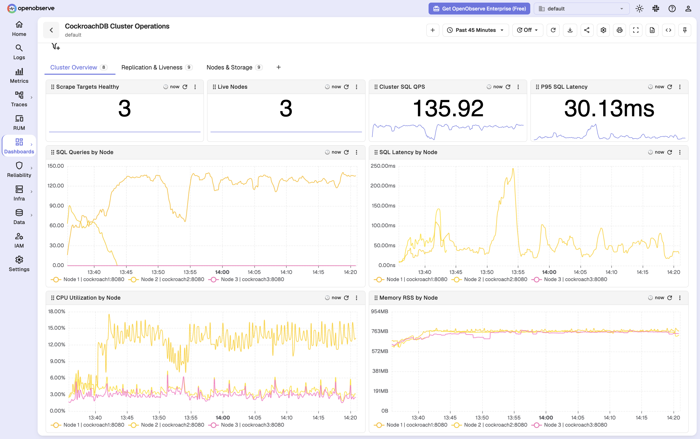
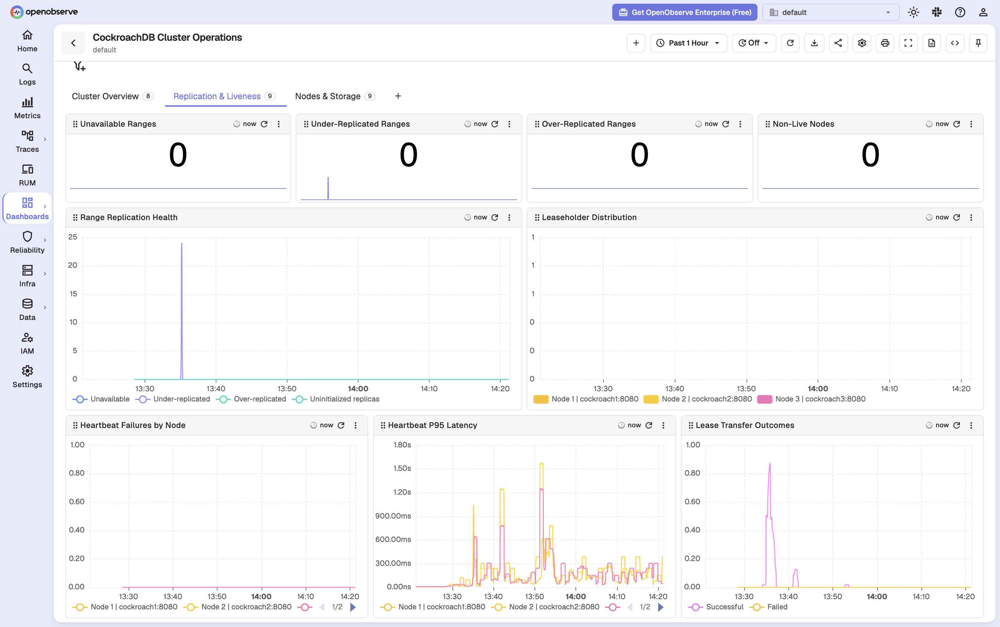
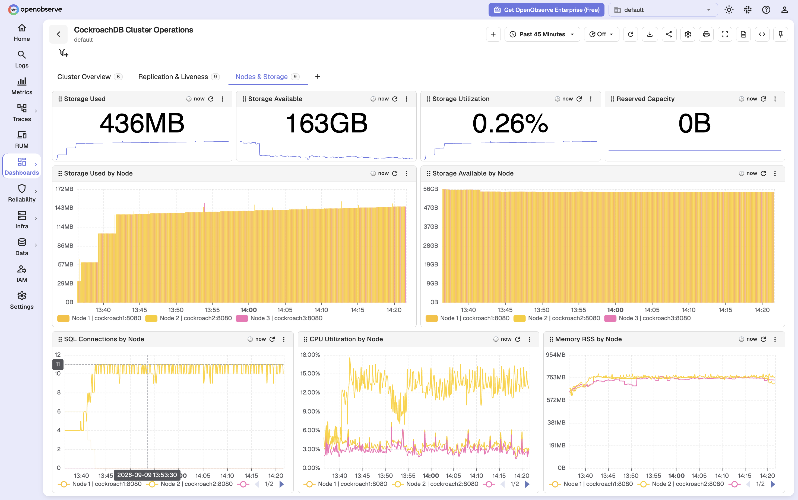

# CockroachDB Dashboards for OpenObserve

Two production-oriented dashboards for monitoring CockroachDB through its built-in Prometheus endpoint:

- **CockroachDB Standalone Operations** monitors SQL performance, connections, storage, and process health for one node.
- **CockroachDB Cluster Operations** monitors cluster-wide SQL performance, node liveness, range replication, leaseholder distribution, and storage capacity.

The dashboards contain 51 panels across six tabs and use only PromQL queries against metrics from `/_status/vars`.

## Prerequisites

- CockroachDB with `/_status/vars` reachable by Prometheus.
- Prometheus remote write configured for OpenObserve.
- A scrape job named `cockroachdb-standalone` for a standalone deployment.
- A scrape job named `cockroachdb-cluster` containing every node in a clustered deployment.

Example scrape configuration:

```yaml
scrape_configs:
  - job_name: cockroachdb-standalone
    metrics_path: /_status/vars
    static_configs:
      - targets: [cockroachdb:8080]

  - job_name: cockroachdb-cluster
    metrics_path: /_status/vars
    static_configs:
      - targets:
          - cockroach1:8080
          - cockroach2:8080
          - cockroach3:8080
```

If existing Prometheus job names differ, update the `job` selectors in the imported dashboards.

## Dashboard Sections

### Standalone Operations

- **Operations Overview**: availability, SQL QPS, latency percentiles, storage utilization, active SQL work, CPU, and memory.
- **SQL Performance**: connections, transactions, SQL failures, full scans, statement throughput, network traffic, and connection activity.
- **Node Resources**: uptime, process memory, file descriptors, CPU, and storage capacity.

### Cluster Operations

- **Cluster Overview**: healthy and live nodes, cluster SQL QPS and latency, plus per-node throughput, latency, CPU, and memory.
- **Replication & Liveness**: unavailable, under-replicated, over-replicated, and uninitialized ranges, node heartbeat health, leaseholders, and lease transfers.
- **Nodes & Storage**: cluster capacity and per-node storage, SQL connections, CPU, and memory.

## Import

Import both dashboard files through the OpenObserve Dashboard UI:

- `CockroachDB Standalone Operations.dashboard.json`
- `CockroachDB Cluster Operations.dashboard.json`

## Screenshots

### Standalone Operations Overview



### Standalone SQL Performance



### Standalone Node Resources



### Cluster Overview



### Cluster Replication and Liveness



### Cluster Nodes and Storage



## Validation

Validated with CockroachDB v24.3.10, Prometheus v3.5.0, and OpenObserve v1.0.0-rc2 using separate standalone and three-node cluster workloads.

## References

- [CockroachDB metrics](https://www.cockroachlabs.com/docs/stable/metrics)
- [CockroachDB monitoring with Prometheus](https://www.cockroachlabs.com/docs/stable/monitor-cockroachdb-with-prometheus)
