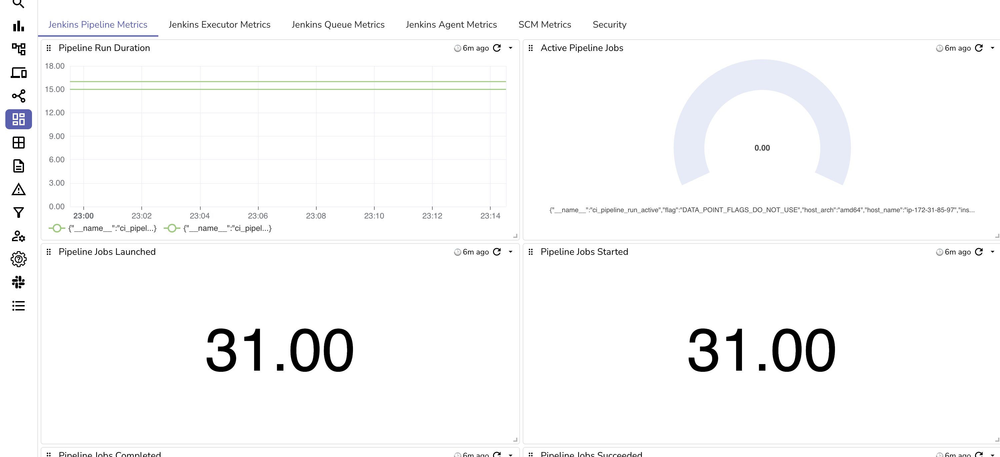
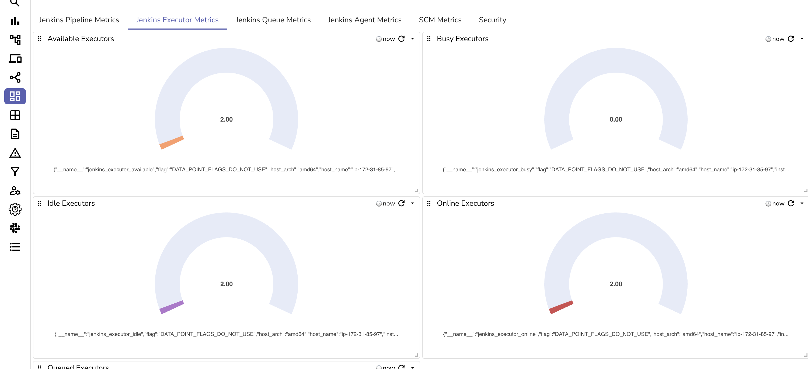
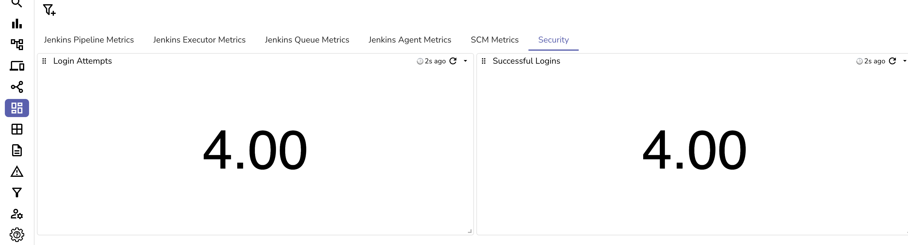

# Jenkins Monitoring Dashboard

This repository contains a JSON file for a comprehensive Jenkins monitoring dashboard on OpenObserve. By importing this dashboard, you gain immediate visibility into key Jenkins metrics, helping you monitor pipeline performance, manage executor usage, track queue statuses, and observe agent metrics—all essential for optimizing CI/CD workflows.

## Dashboard Features
The JSON file includes panels covering various critical metrics, such as:

- Jenkins Pipeline Metrics: Visualize and monitor the performance and health of each pipeline stage.
- Jenkins Executor Metrics: Track executor availability and usage to prevent bottlenecks.
- Jenkins Queue Metrics: Observe queued jobs to reduce wait times and improve throughput.
- Jenkins Agent Metrics: Monitor connected agents for performance and health status.
- SCM Metrics: Get insights into source code management (SCM) interactions and repository data.
- Security: Keep track of security-related metrics to identify potential vulnerabilities.

