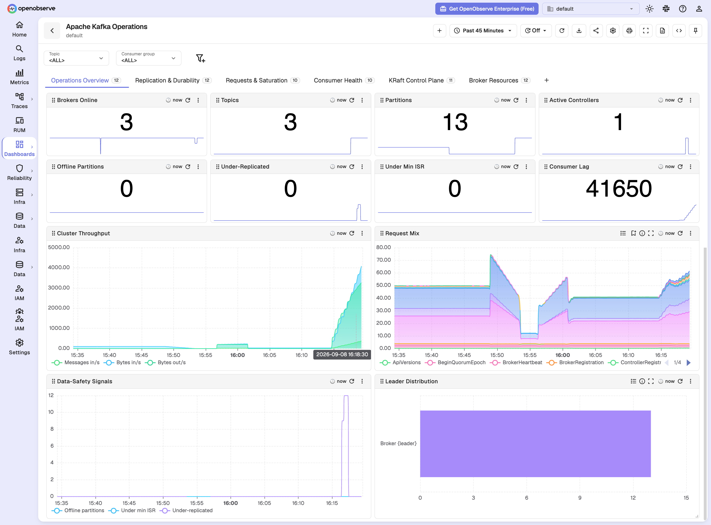
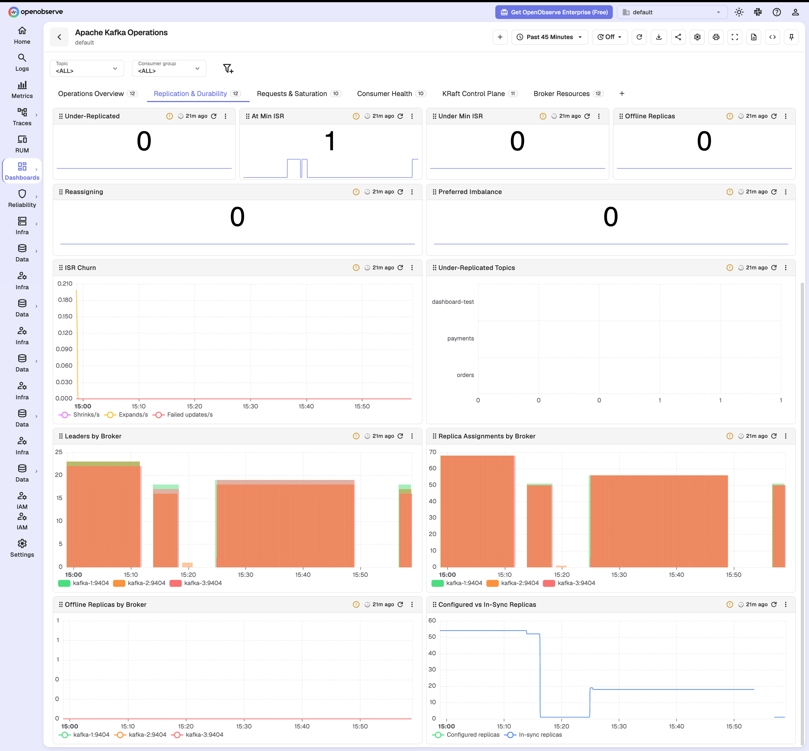
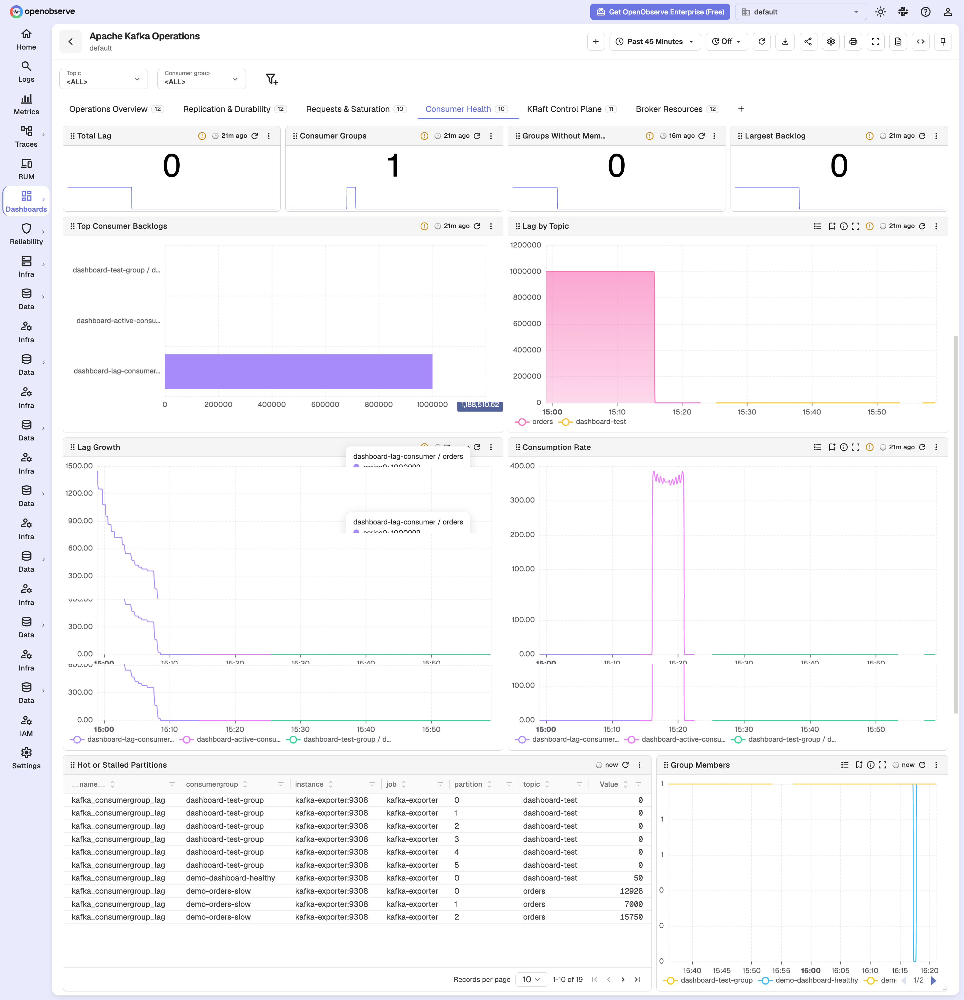
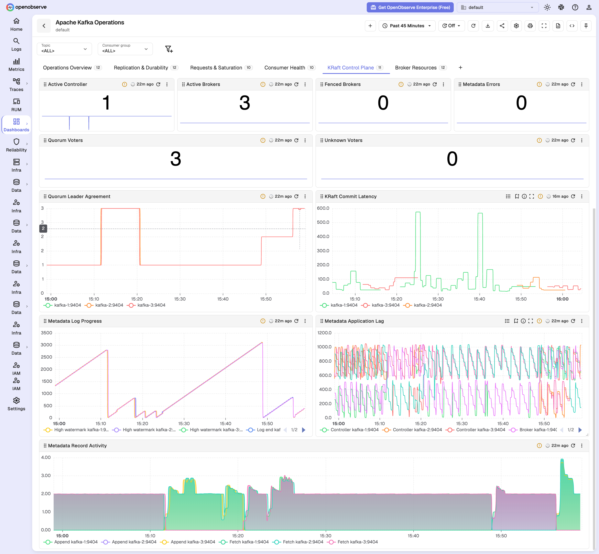
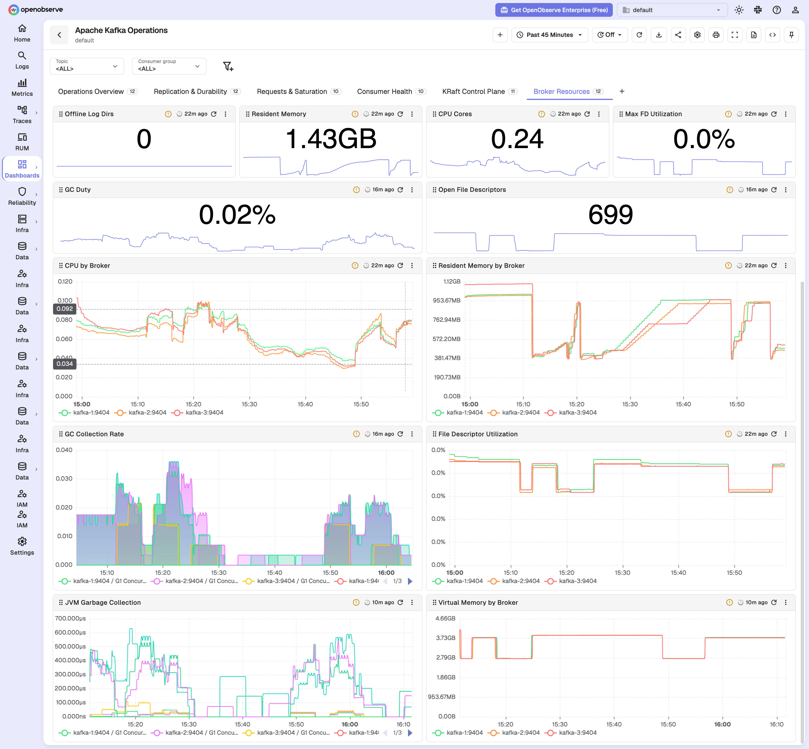

# Apache Kafka Monitoring Dashboard for OpenObserve

Production operations dashboard for Apache Kafka 4.x KRaft clusters. It has 67 panels across six full-width tabs covering availability, durability, request performance, consumer health, the KRaft control plane, and broker resources.

The dashboard follows the operational signals emphasized by Apache Kafka, Strimzi, and the Kafka Exporter community dashboards. Overview panels stay bounded and actionable; detailed views use top-k aggregation to remain usable as topic and consumer-group counts grow.

## Prerequisites

- Apache Kafka 4.x brokers exposing Prometheus metrics through `prometheus/jmx_exporter`.
- `danielqsj/kafka_exporter` v1.9.0 or compatible, with permissions to describe brokers, topics, and consumer groups.
- Prometheus remote write configured to send both exporters to OpenObserve.

The dashboard was tested with Kafka 4.0.0, JMX Exporter 1.6.0, Kafka Exporter 1.9.0, Prometheus 3.5.0, and OpenObserve v1.0.0-rc2.

## Required Metrics

Kafka Exporter provides cluster topology and consumer-group data:

- `kafka_brokers`
- `kafka_topic_partitions`
- `kafka_topic_partition_replicas`
- `kafka_topic_partition_in_sync_replica`
- `kafka_topic_partition_under_replicated_partition`
- `kafka_topic_partition_leader_is_preferred`
- `kafka_consumergroup_lag_sum`
- `kafka_consumergroup_members`

JMX Exporter provides broker operation and KRaft metrics:

- Aggregate `kafka_server_brokertopicmetrics_*` traffic and failure counters
- `kafka_server_replicamanager_*` durability and assignment metrics
- `kafka_controller_kafkacontroller_*` and `kafka_controller_controllerstats_*`
- `kafka_network_requestmetrics_*` request rates, errors, and latency phases
- `kafka_network_requestchannel_*` queue depths
- `kafka_network_socketserver_networkprocessoravgidlepercent`
- `kafka_server_raft_metrics_*` and broker metadata metrics
- `kafka_log_logmanager_offlinelogdirectorycount`
- `jvm_gc_collection_seconds_*`
- `process_cpu_seconds_total`
- `process_open_fds` and `process_max_fds`
- `process_resident_memory_bytes`
- `process_virtual_memory_bytes`

Configure JMX Exporter to restrict request-latency percentiles to Produce, Fetch, FetchFollower, and Metadata APIs and avoid exporting per-topic JMX traffic duplicates.

## Dashboard Sections

- **Operations Overview**: compact health strip, throughput, request mix, durability signals, and leader distribution.
- **Replication & Durability**: under-replication, min-ISR risk, offline replicas, reassignments, ISR churn, and broker balance.
- **Requests & Saturation**: API rate and error ratio, p99 latency, Produce latency phases, broker queues, and network-processor idle capacity.
- **Consumer Health**: absolute lag, lag growth, consumption progress, inactive groups, top backlogs, and partition-level hotspots.
- **KRaft Control Plane**: leader agreement, voters, fenced brokers, metadata errors and lag, election/commit latency, and metadata-log progress.
- **Broker Resources**: CPU, resident and virtual memory, garbage collection, file descriptors, and offline log directories.

## Design Notes

- Cluster replication totals use `kafka_topic_partition_under_replicated_partition` from Kafka Exporter. Do not sum the JMX `UnderReplicatedPartitions` metric across brokers because it is broker-local and double counts replica assignments.
- Normal lag views use the pre-aggregated `kafka_consumergroup_lag_sum` metric and limit the group/topic panel to the top 20 series.
- Topic/partition metrics are used only for replication and consumer drilldowns. Overview traffic charts use the all-topic JMX MBean; the curated JMX configuration excludes its per-topic duplicate.
- Request errors exclude `error="NONE"`; this makes the panel represent actual non-successful Kafka responses.
- The dashboard aggregates Kafka metrics in the selected OpenObserve organization. Add a `cluster` matcher to its PromQL queries when an organization contains multiple clusters and needs isolated views.
- Request latency uses p99 values and never averages broker percentile gauges. The worst broker is displayed because averaging percentiles is statistically invalid and can hide a single degraded broker.
- Consumer lag has no universal safe offset threshold. Interpret absolute lag together with lag growth and application freshness SLOs.
- Host disk capacity, filesystem latency, and network saturation require Node Exporter, OpenTelemetry host metrics, or equivalent infrastructure telemetry. They are intentionally not fabricated from Kafka metrics.

## Import

Import `Kafka Monitoring Dashboard.dashboard.json` from the OpenObserve Dashboard UI.

## Screenshots

### Operations Overview

### Replication & Durability

### Consumer Health

### KRaft Control Plane

### Broker Resources

## Variables

- **Topic** filters topology, replication, and consumer panels.
- **Consumer group** filters consumer-lag and member panels.

## References

- [Apache Kafka 4.0 monitoring](https://kafka.apache.org/40/operations/monitoring/)
- [Strimzi Kafka dashboard](https://github.com/strimzi/strimzi-kafka-operator/blob/main/examples/metrics/grafana-dashboards/strimzi-kafka.json)
- [Strimzi Kafka Exporter dashboard](https://github.com/strimzi/strimzi-kafka-operator/blob/main/examples/metrics/grafana-dashboards/strimzi-kafka-exporter.json)
- [Kafka Exporter dashboard 7589](https://grafana.com/grafana/dashboards/7589-kafka-exporter-overview/)
