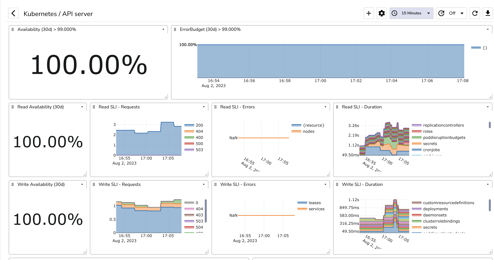
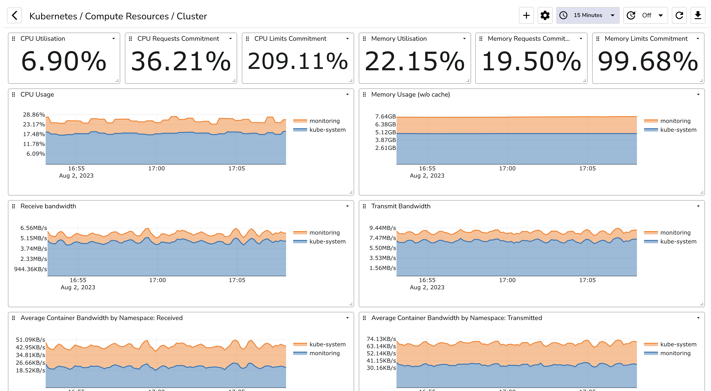

# Kubernetes

These dashboards are designed to be used with the [Kubernetes](https://kubernetes.io/) and prometheus metrics.

## Kubernetes / API Server

## Kubernetes / Compute Resources / Cluster

## Kubernetes / Compute Resources / Namespace (Workloads)

 