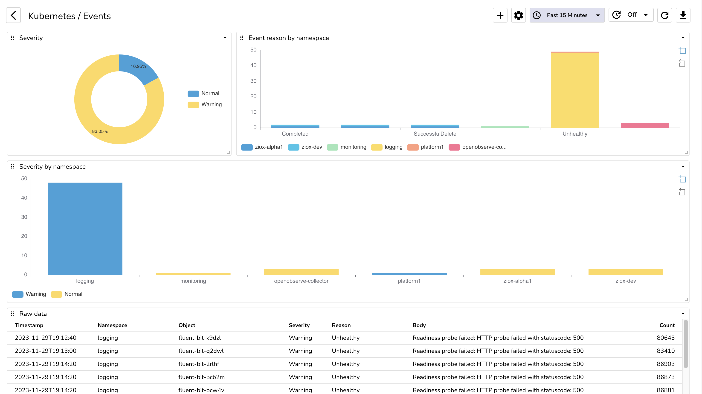
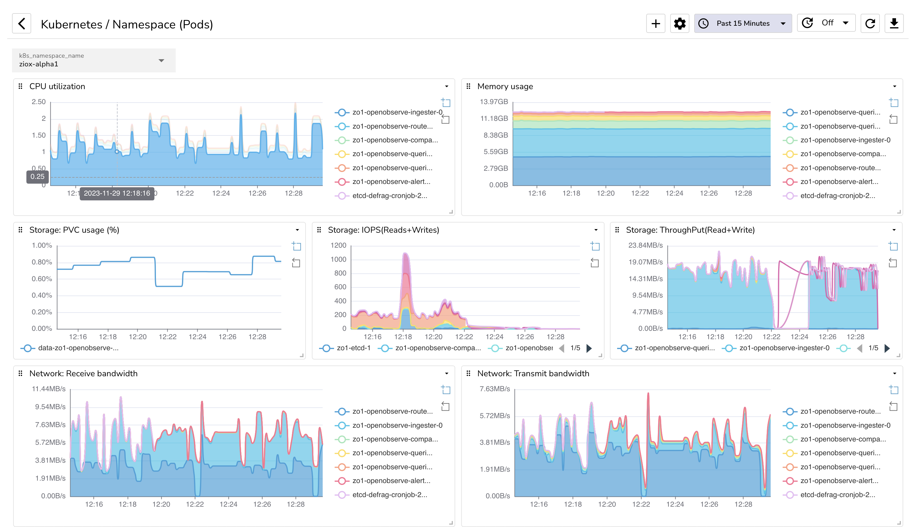
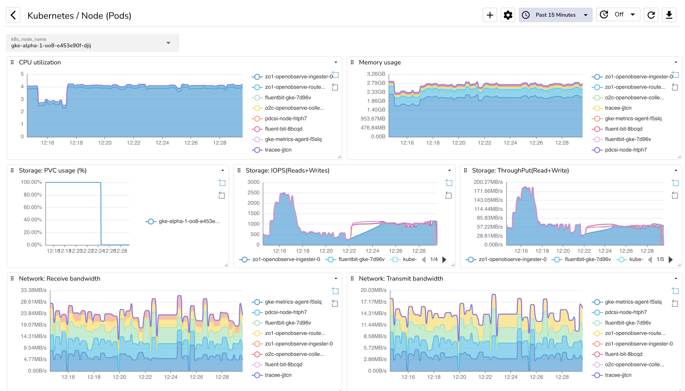
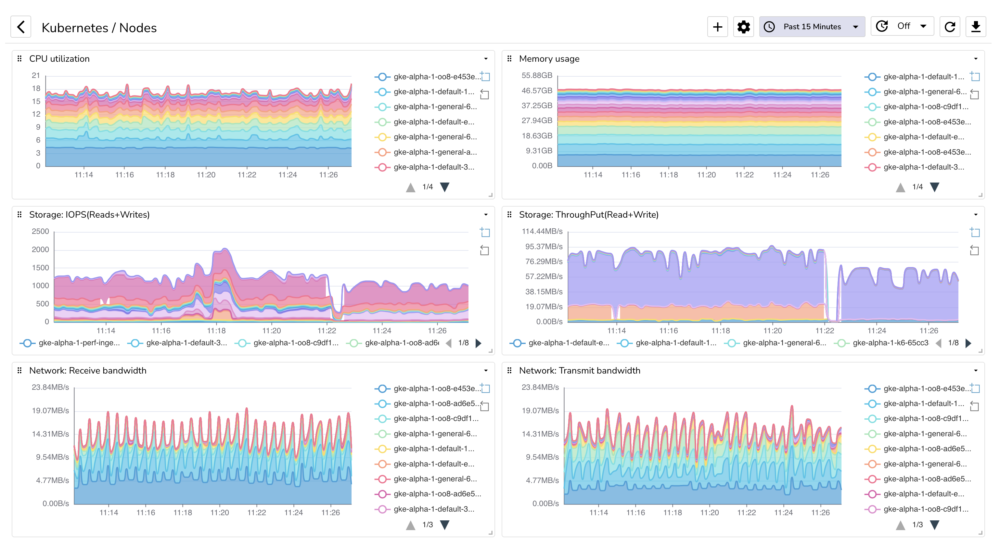

# Kubernetes dashboards

This folder contains Kubernetes dashboards for OpenObserve. These are built on top of data collected by openobserve-collector (otel-collector configured to collect Kubernetes metrics specifically for OpenObserve). Check configuration at https://github.com/openobserve/openobserve-helm-chart/tree/main/charts/openobserve-collector

## Events

 

## Namespace (Pods)

 

## Node (Pods)

 

## Nodes

 
