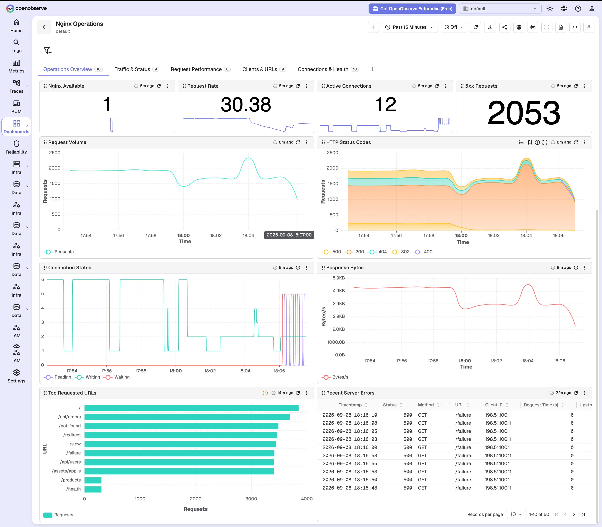
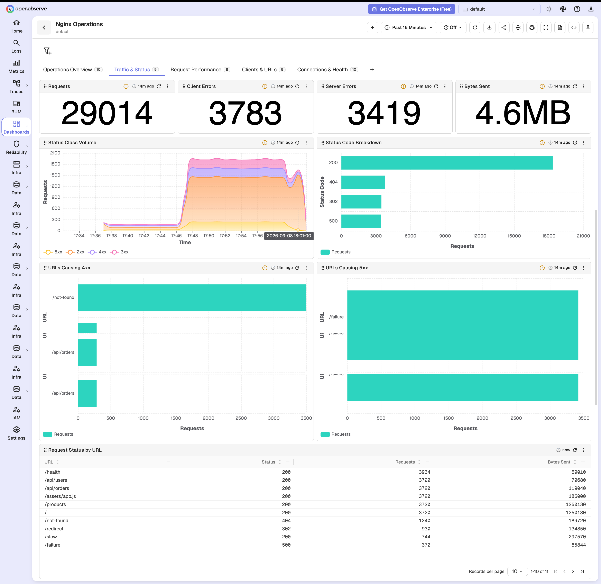
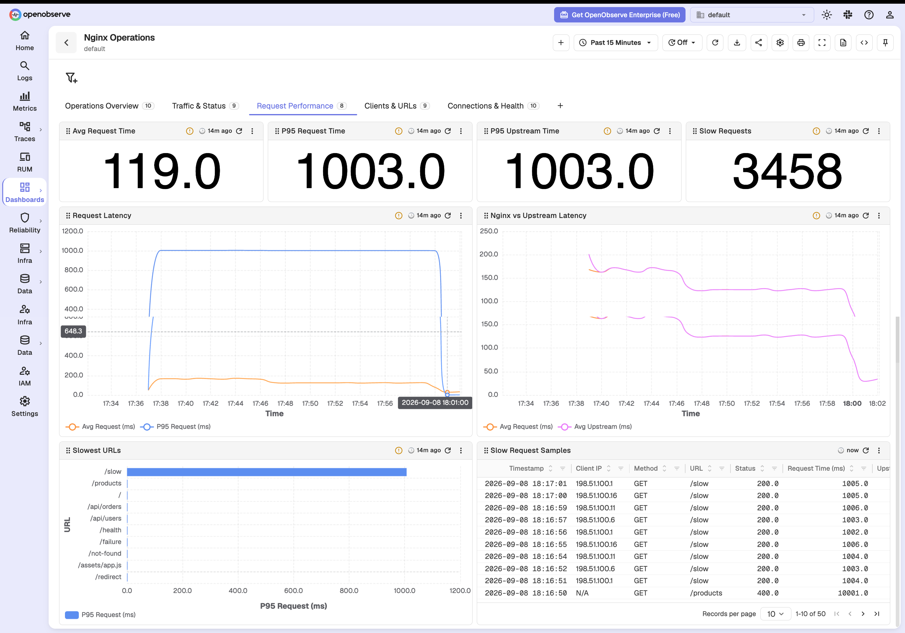
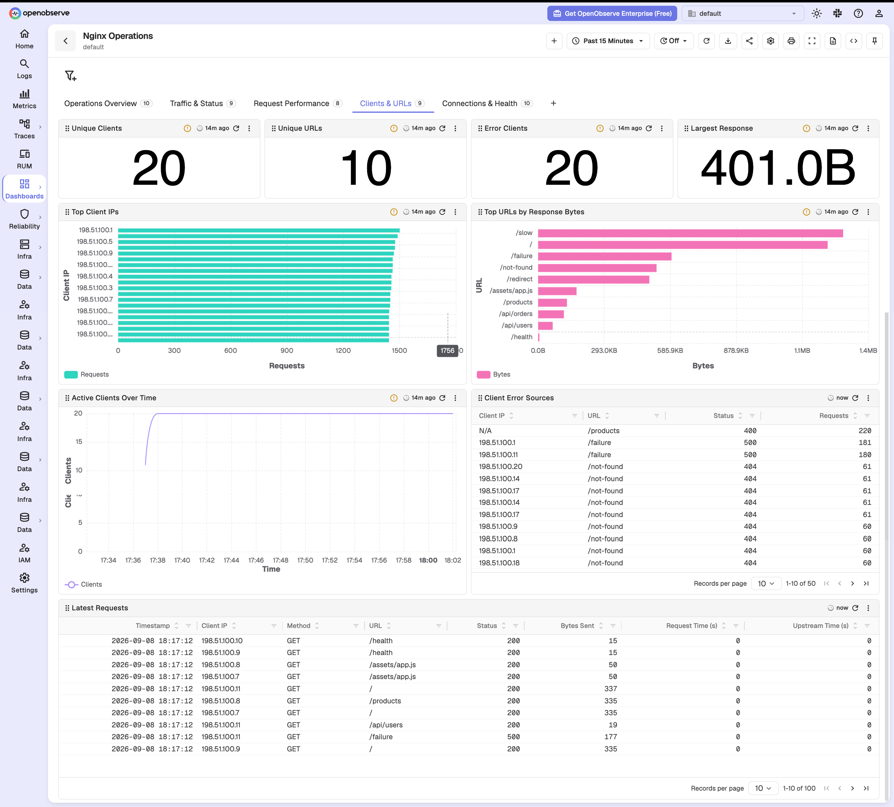
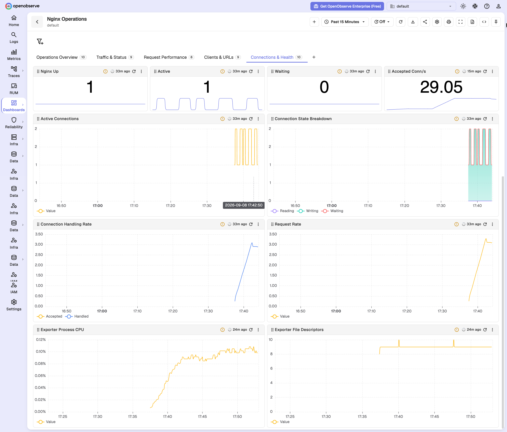

# Nginx Operations Dashboard for OpenObserve

Production operations dashboard for Nginx OSS. It has 46 panels across five tabs that combine structured access logs with `stub_status` metrics from `nginx-prometheus-exporter`.

## Prerequisites

- Nginx OSS with the `stub_status` module enabled on a protected internal endpoint.
- `nginx/nginx-prometheus-exporter` scraping that endpoint.
- Structured Nginx access logs ingested into an OpenObserve logs stream named `nginx_access`.
- Prometheus remote write configured to send Nginx exporter metrics to OpenObserve.

The dashboard was validated with Nginx 1.28, nginx-prometheus-exporter 1.5.1, Fluent Bit 4.1.2, Prometheus 3.5.0, and OpenObserve v1.0.0-rc2.

## Required Data

### Metrics

- `nginx_up`
- `nginx_http_requests_total`
- `nginx_connections_accepted`
- `nginx_connections_handled`
- `nginx_connections_active`
- `nginx_connections_reading`
- `nginx_connections_writing`
- `nginx_connections_waiting`

### Access logs

The `nginx_access` stream must contain these fields:

- `_timestamp`
- `client_ip`
- `method`
- `path`
- `status`
- `bytes_sent`
- `request_time` in seconds
- `upstream_time` in seconds, with `0` for direct Nginx responses

Use a JSON `log_format` and ship the access log with Fluent Bit, OpenTelemetry Collector, Vector, or an equivalent agent. Normalize upstream values such as `-` to `0` before ingestion so latency queries remain numeric.

## Dashboard Sections

- **Operations Overview**: availability, request rate, connection state, response bytes, top URLs, and latest server errors.
- **Traffic & Status**: request volume, status codes, client/server errors, and URL error drilldowns.
- **Request Performance**: average and P95 request and upstream latency, latency trends, slow URLs, and slow request samples.
- **Clients & URLs**: unique clients and URLs, top clients, transfer-heavy URLs, error sources, and recent requests.
- **Connections & Health**: stub-status availability, active and waiting connections, connection handling, exporter CPU, and file descriptors.

## Notes

- Nginx OSS `stub_status` does not expose status-code, URL, client, byte, or request-latency dimensions. Those panels intentionally query access logs.
- `request_time` is end-to-end Nginx processing time. Compare it with `upstream_time` to distinguish upstream slowness from proxy or response-transfer overhead.
- High-cardinality URLs and client IPs are limited to top results. Avoid logging unbounded identifiers in `path`; normalize routes at ingestion when possible.
- The exporter process CPU and file descriptor panels monitor the exporter only. Add host or container telemetry when Nginx worker resource utilization is required.

## Import

Import `Nginx Operations Dashboard.dashboard.json` from the OpenObserve Dashboard UI.

## Screenshots

### Operations Overview

### Traffic & Status

### Request Performance

### Clients & URLs

### Connections & Health

## References

- [Nginx stub_status module](https://nginx.org/en/docs/http/ngx_http_stub_status_module.html)
- [NGINX Prometheus Exporter](https://github.com/nginx/nginx-prometheus-exporter)
- [Nginx logging module](https://nginx.org/en/docs/http/ngx_http_log_module.html)
