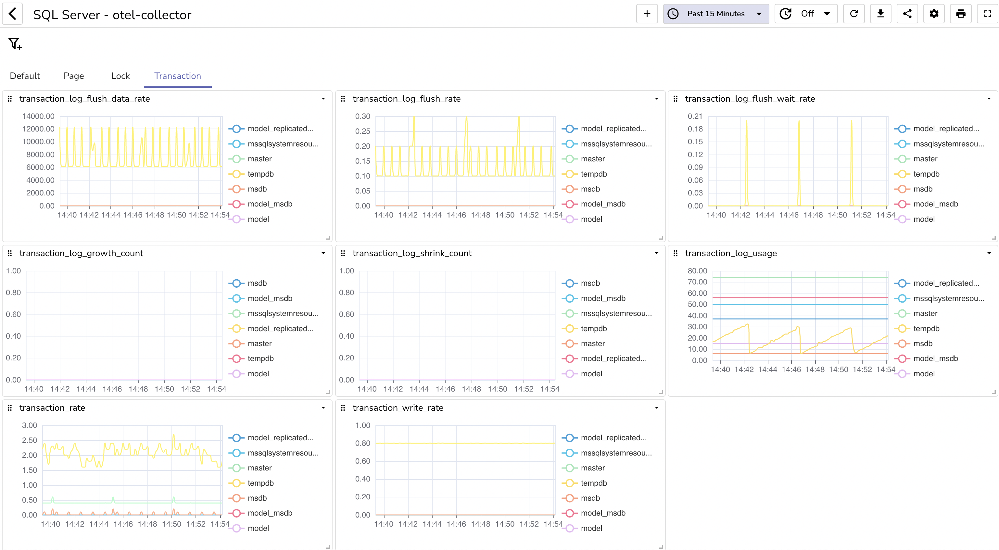

# SQL Server dashboard

This dashboard provides an overview of the performance and health of your SQL Server instances. It includes several metrics for Pages, Batches, Transactions, and Locks, as well as detailed information about the log flushes per second for all databases.

otel-collector is used to collect all the information. Check detailed information about [sqlserverreceiver](https://github.com/open-telemetry/opentelemetry-collector-contrib/tree/main/receiver/sqlserverreceiver) of otel-collector for more details.

Information from the SQL server instance is collected either via performance counters or by directly logging into the SQL server and running SQL queries.

An example of the SQL query used to get the log flushes per second for all databases is shown below:

```sql
-- Query to get log flushes per second for all databases
SELECT
    DB_NAME(database_id) AS DatabaseName,
    log_flushes_per_sec
FROM
    sys.dm_db_log_stats(NULL);

-- Query to get detailed log statistics for a specific database
SELECT
    DB_NAME(database_id) AS DatabaseName,
    log_flushes_per_sec,
    log_bytes_flushed_per_sec,
    log_cache_hit_ratio,
    log_file_size_used_percent
FROM
    sys.dm_db_log_stats(DB_ID('YourDatabaseName'));
```


