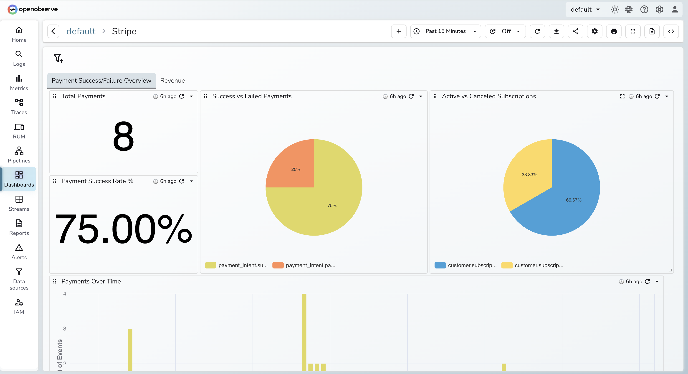
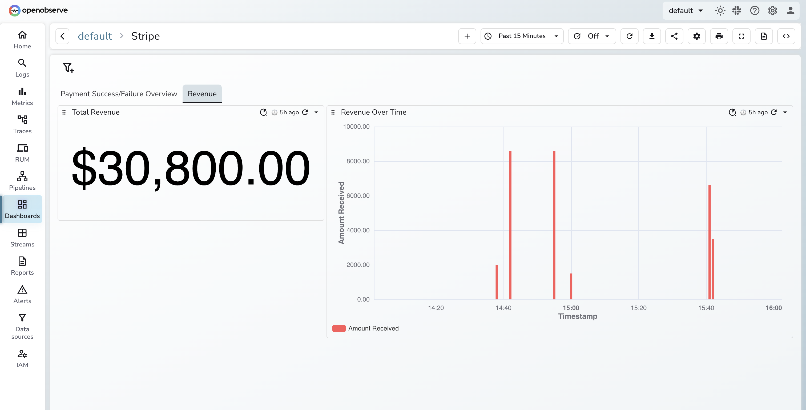

# Stripe Dashboard for OpenObserve

This repository contains a ready-to-use **OpenObserve Dashboard JSON** that helps you monitor Stripe payments, revenue trends, and key business metrics in real time.

## Overview

The dashboard visualizes Stripe event data ingested into OpenObserve and provides insights such as:

* Total revenue
* Number of payments
* Successful vs failed charges
* Revenue over time , etc

It’s designed to be plug-and-play, simply import the JSON and connect it to your Stripe event stream.

## How to Use

1. Open **OpenObserve Dashboard** → *New Dashboard*
2. Click **Import**
3. Upload the `stripe_dashboard.json` file from this repo
4. Select your folder and save
5. Make sure your Stripe events are being ingested into the correct stream/table referenced in the dashboard queries

Your dashboard will start displaying data immediately once Stripe events are available.

## Customization

Feel free to:

* Add or remove panels
* Change the SQL queries
* Adjust time ranges or filters
* Add tabs for subscription analytics, refunds, or fraud detection

## Contributing

Pull requests are welcome, especially new panels, optimizations, or support for additional Stripe events.

## Support

If you found this helpful, consider starring the repo!
For more help, visit the [OpenObserve documentation](https://openobserve.ai/docs/).

