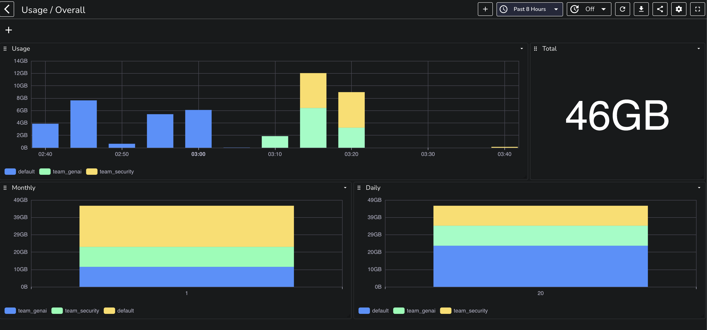
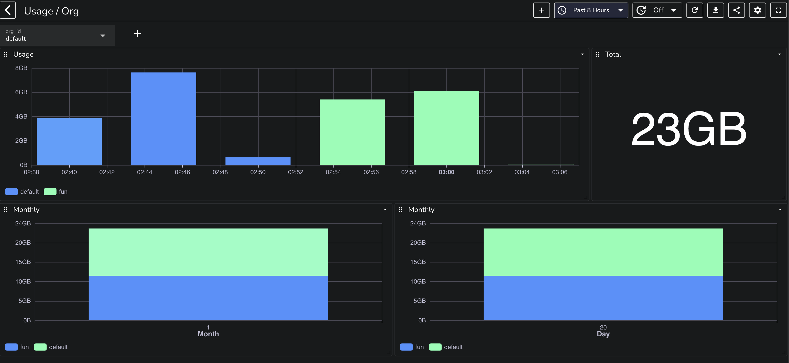

# Usage reporting

Once you set `ZO_USAGE_REPORTING_ENABLED=true` for your OpenObserve installation you will be able to get the usage report for your installation. This can be used to understand the usage of your installation. Additionally you could use this information to chargeback if if you have multiple orgs/teams using your installation.

Raw data is available in `_meta` org.

## Usage / Overall

## Usage / org

